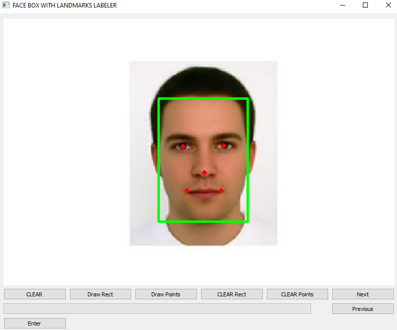

# Tool for Face Box and Landmark Labeling

<div align="center">
    <picture>
        
    </picture>
</div>

## Installation
```bash
pip install requirements.txt
```


## Usage
### 1.Create an empty label file:
```bash
python create_file_label_txt.py
```

### 2. Launch the labeling tool:
```bash
python face_landmarks_labeling.py
```
